#  Home Recipe Organizer

**Home Recipe Organizer** is a full‑stack client–server application that helps users decide what to cook based on the ingredients they already have at home. Users manage their personal ingredient list, browse recipes, and receive smart recipe recommendations based on ingredient matching logic.

This project is designed as a **portfolio‑grade application** with a strong focus on backend architecture, relational database design, and real‑world business logic.

---

## Database Schema

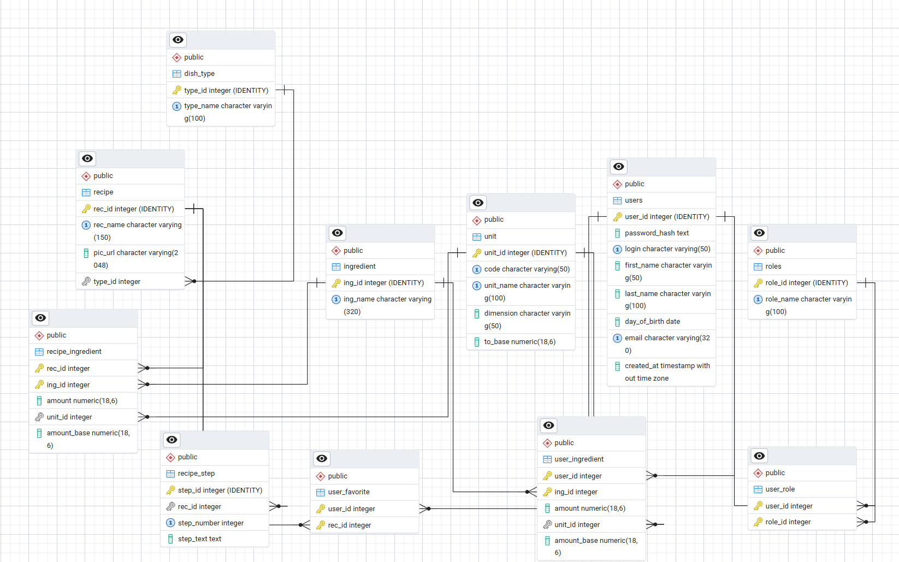

---

### Overview

The database schema is designed around four main concerns:

- User authentication and authorization
- Recipe structure and classification
- Ingredient management with unit normalization
- User-specific data (owned ingredients and favorites)

All tables are normalized and connected through explicit foreign keys.

---

### Core Tables

#### users
Stores registered application users.

Key fields:
- user_id (PK)
- login
- password_hash
- email
- first_name, last_name
- created_at

Relationships:
- many-to-many with roles via user_role
- one-to-many with user_ingredient
- one-to-many with user_favorite

---

#### roles
Defines system roles.

Key fields:
- role_id (PK)
- role_name

Relationships:
- many-to-many with users via user_role

---

#### recipe
Stores general recipe information.

Key fields:
- rec_id (PK)
- rec_name
- pic_url
- type_id (FK → dish_type)

Relationships:
- one-to-many with recipe_ingredient
- one-to-many with recipe_step
- many-to-many with users via user_favorite

---

#### dish_type
Defines recipe categories (dish types).

Key fields:
- type_id (PK)
- type_name

Relationships:
- one-to-many with recipe

---

### Ingredients and Units

#### ingredient
Master list of ingredients shared across all users and recipes.

Key fields:
- ing_id (PK)
- ing_name

Relationships:
- many-to-many with recipe via recipe_ingredient
- many-to-many with users via user_ingredient

---

#### unit
Defines measurement units and conversion factors.

Key fields:
- unit_id (PK)
- code (g, oz, ml, pc)
- unit_name
- dimension
- to_base

The to_base field represents a multiplier used to convert values into a base unit within the same dimension.

Relationships:
- referenced by recipe_ingredient
- referenced by user_ingredient

---

### Join Tables

#### recipe_ingredient
Connects recipes with required ingredients.

Key fields:
- rec_id (FK → recipe)
- ing_id (FK → ingredient)
- unit_id (FK → unit)
- amount
- amount_base

Purpose:
- stores ingredient quantities per recipe
- amount_base enables direct comparison with user ingredients

---

#### recipe_step
Stores step-by-step cooking instructions.

Key fields:
- step_id (PK)
- rec_id (FK → recipe)
- step_number
- step_text

---

#### user_ingredient
Stores ingredients owned by a specific user.

Key fields:
- user_id (FK → users)
- ing_id (FK → ingredient)
- unit_id (FK → unit)
- amount
- amount_base

Purpose:
- tracks available ingredients per user
- normalized amounts allow accurate recipe matching

---

#### user_favorite
Stores recipes marked as favorites by users.

Key fields:
- user_id (FK → users)
- rec_id (FK → recipe)

---

#### user_role
Join table for users and roles.

Key fields:
- user_id (FK → users)
- role_id (FK → roles)

---

### Design Notes

- All numeric ingredient values are normalized using amount_base
- Join tables are used for all many-to-many relationships
- The schema supports efficient recipe matching and future extensibility
- Business logic is intentionally enforced at the service layer, not in the database

## Java Server Side

The server side of the application is implemented as a RESTful API using **Java and Spring Boot**.  
It follows a layered architecture with explicit separation between controllers, services, data access, and security.

The backend is responsible for authentication, authorization, recipe matching logic, ingredient management, and interaction with the PostgreSQL database.

---

### Backend Architecture

The server is organized into the following logical layers:

- **Controllers**  
  Expose REST endpoints and handle HTTP request/response mapping.  
  Examples: `RecipeController`, `UserIngredientController`, `UserFavoriteController`, `SecurityController`.

- **Services**  
  Contain business logic, validation, and user-specific access control.  
  Examples: `RecipeService`, `UserIngredientService`, `UserFavoriteService`, `UnitService`.

- **DAO Layer**  
  Responsible for data access and SQL execution.  
  Implemented using DAO interfaces and JDBC-based implementations.

- **DTOs**  
  Define request payloads for create and update operations, keeping API contracts explicit and stable.

- **Mappers (RowMapper)**  
  Convert SQL `ResultSet` rows into domain entities and view DTOs.

- **Security Layer**  
  Handles authentication and authorization using JWT and Spring Security.

---

### Data Access Strategy

Most domain logic uses **JDBC with explicit SQL** via `JdbcTemplate`.

The common pattern is:

- DAO interface (contract)
- JDBC implementation
- Dedicated `RowMapper`

Examples:
- `UserIngredientDao` → `JdbcUserIngredientDao` → `UserIngredientRowMapper`
- `DaoRecipe` → `JdbcRecipeDao` → `RecipeMapper`
- `DaoDishIng` → `JdbcDishIngDao` → `DishIngMapper`

Spring Data JPA repositories are used selectively for reference data (units, roles, dish types, users), where complex queries are not required.

This approach provides full control over SQL, predictable performance, and transparency in data access.

---

### Authentication and Authorization

Authentication is implemented using **JWT (JSON Web Tokens)**:

- Users authenticate via the `SecurityController`
- A JWT token is issued on successful login
- `TokenFilter` validates the token on each request and sets the authenticated principal
- User roles are loaded from the database and mapped to Spring Security authorities

The security layer is stateless and fully separated from business logic.

---

### Error Handling

The backend uses centralized exception handling:

- Custom exceptions (`DaoException`, `NotFoundException`) represent domain-level errors
- Global exception handlers translate exceptions into meaningful HTTP responses

This ensures consistent API behavior and clear error reporting to the client.

# Client (Frontend)

The client side of the application is a single-page application built with **React**.  
It provides user authentication, ingredient management, recipe browsing, and personalized user interactions.

---

### Technology Stack

- HTML5
- CSS3
- JavaScript (ES6+)
- React
- React Router
- Axios

---

### React Hooks Used

The application actively uses React Hooks for state management and lifecycle control:

- `useState` — local component state (forms, selections, UI state)
- `useEffect` — data fetching and synchronization with the backend
- `useContext` — global authentication state (JWT token, login/logout)
- `useParams` — route parameters (e.g. recipe id)
- `useNavigate` — client-side navigation
- `useMemo` — derived data optimization (filtering, computed lists)

---

## Authentication Flow

### Login

The login page allows users to authenticate using **login or email + password**.

- Sends credentials to the backend authentication endpoint
- Receives a JWT token on success
- Stores the token in application context
- Redirects the user to protected routes

UI example:

---

### Registration

The registration page allows users to create a new account.

Collected data:
- login
- first name
- last name
- email
- password
- birth date

After successful registration, the user can immediately log in.

UI example:
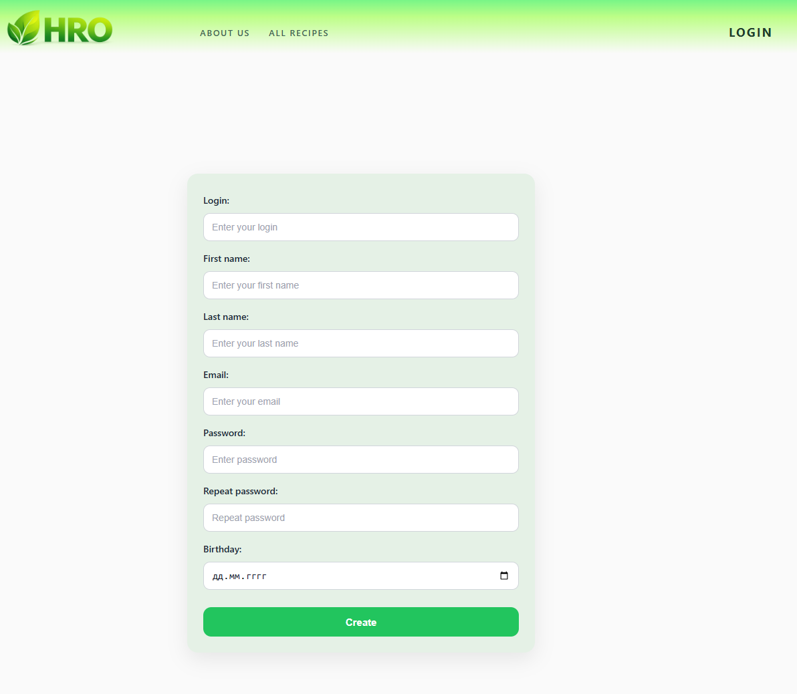

---

## Recipes

### All Recipes Page

Displays all available recipes as cards with images and titles.

Features:
- search by recipe name
- filter by dish type
- navigation to recipe details
- visual indication for favorite recipes

UI examples:
- `rec/all_recipes.png`
- `rec/all_rec_like.png`

---

### Recipe Details

Each recipe page displays:

- recipe image
- list of ingredients with amounts and units
- step-by-step cooking instructions
- favorite (like) button

UI example:
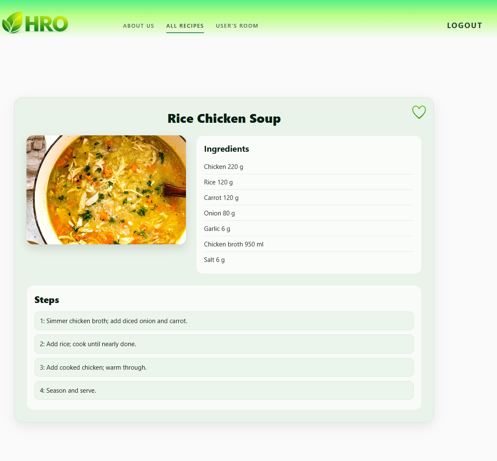
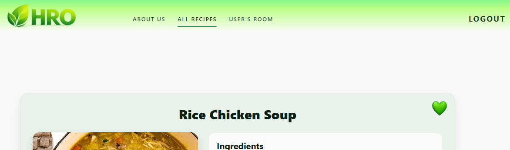

---

## Favorites (Like)

Users can mark recipes as favorites:

- favorites are stored per user
- displayed with a visual indicator (heart icon)
- available in the User Room

This feature is fully synchronized with the backend.
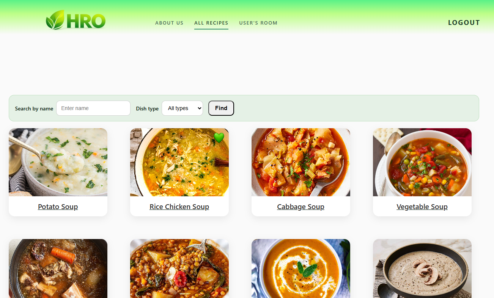
---

## User Room

The **User Room** is a personalized dashboard for the authenticated user.

It contains:
- favorite recipes
- current list of owned ingredients
- navigation to ingredient management

UI example:
- 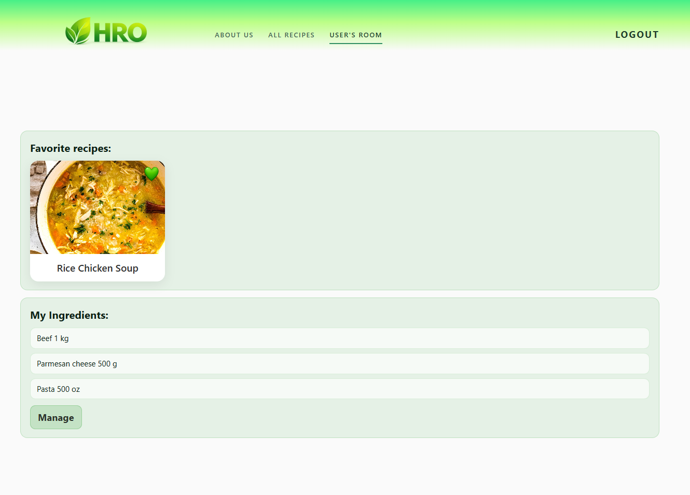

---

## Ingredient Management

### View Ingredients

Displays all ingredients currently owned by the user with their amounts and units.

UI example:
- 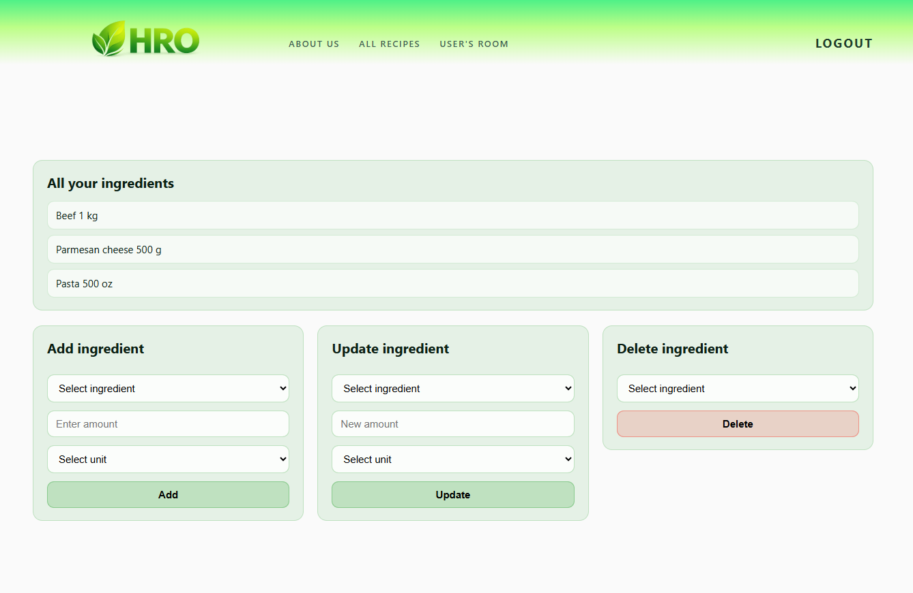

---

### Add Ingredient

Allows the user to:
- select an ingredient from the global list
- enter an amount
- choose a unit

The application automatically normalizes units on the backend.

UI example:
- 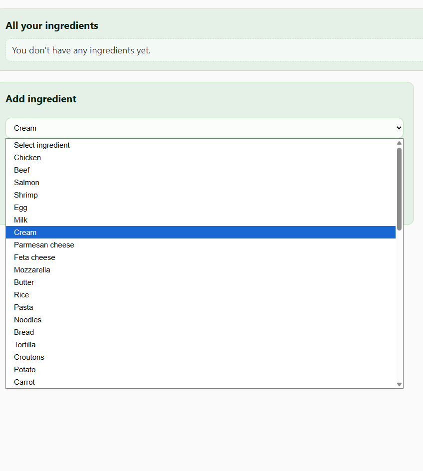
- 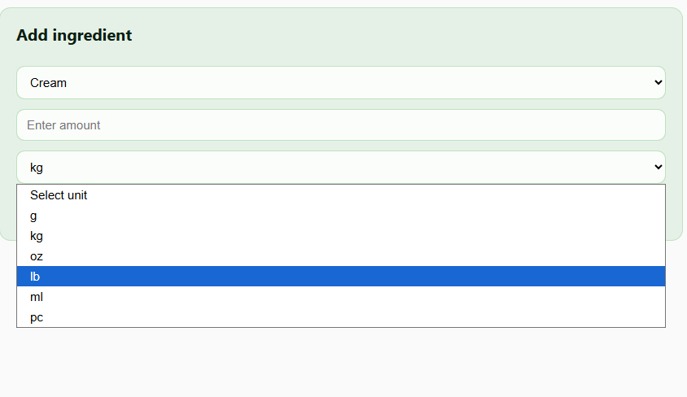

---

### Update Ingredient

Allows updating:
- amount
- unit

UI example:
- 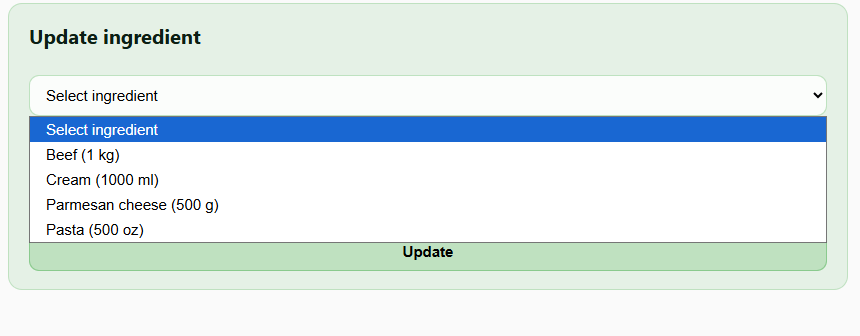

---

### Delete Ingredient

Allows removing an ingredient from the user's list.

UI example:
- 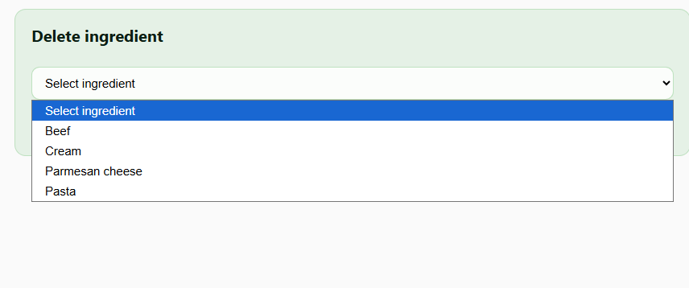

---

## Client–Server Interaction

- All API calls are performed using **Axios**
- JWT token is attached to requests for protected endpoints
- The UI reacts dynamically to backend responses
- Errors are handled gracefully and reflected in the interface

The frontend is tightly integrated with backend logic while keeping concerns separated.

